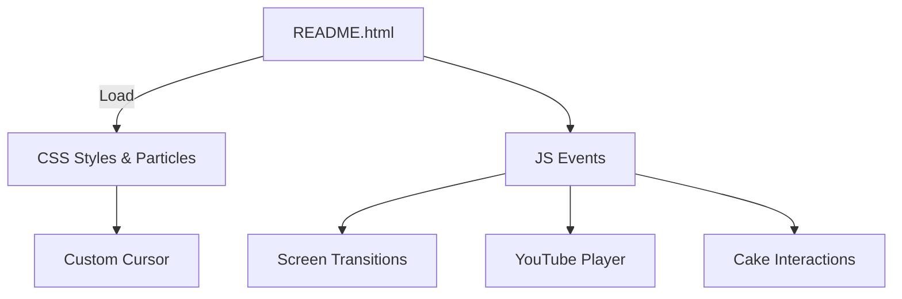

# 🎉 NINIBDAY - Interactive Birthday Celebration Hub

[](https://developer.mozilla.org/en-US/docs/Web/HTML)
[](https://developer.mozilla.org/en-US/docs/Web/CSS)
[](https://developer.mozilla.org/en-US/docs/Web/JavaScript)

> A delightful, interactive single-page web application crafted as a personalized 19th birthday gift for Nini. It weaves heartfelt messages, enchanting animations, and engaging elements into a magical digital celebration, perfect for creating unforgettable memories on special occasions.

<div align="center">

</div>

---

## 🎂 Overview

**NINIBDAY** is a charming, vanilla web experience designed to surprise and delight on Nini's 19th birthday. This single-page application unfolds like an interactive storybook, guiding users through a series of screens filled with personalized touches, whimsical animations, and emotional surprises. From a sparkling welcome to a virtual cake-lighting ritual, every element is handcrafted to evoke joy and warmth.

Built entirely with HTML5, CSS3, and vanilla JavaScript, NINIBDAY prioritizes simplicity and performance—loading instantly without dependencies. It's fully responsive, ensuring a seamless journey on any device, and serves as a heartfelt digital card that can be shared via link for remote well-wishes.

This project showcases creative frontend techniques for personal milestones, making it a great starting point for similar custom celebrations. No backend required; just open the HTML file and let the magic begin.

### Why NINIBDAY?
- **Purely Frontend**: Lightweight and self-contained for easy sharing.
- **Emotionally Engaging**: Blends storytelling with interactive surprises.
- **Device-Agnostic**: Works offline after loading, with touch-friendly controls.
- **Customizable**: Edit messages, animations, or add screens in plain code.

---

## 🌟 Key Features

NINIBDAY delivers a curated flow of birthday wonders through simple yet impactful interactions:

### 🎈 Magical Welcome & Storytelling
- **Interactive Narrative**: A guided journey through screens revealing birthday wishes, memories, and fun facts about Nini.
- **Smooth Transitions**: CSS-powered fades and slides for cinematic screen changes.

### ✨ Animated Elements
- **Particle Background**: Dynamic, twinkling particles that respond to mouse movement, creating a festive atmosphere.
- **Custom Cursor**: A playful, themed cursor that enhances immersion (e.g., a sparkling star trail).

### 🍰 Virtual Birthday Cake
- **19 Candles Ritual**: Click to "light" each candle with flame animations, accompanied by a celebratory sound effect (via JS audio).
- **Blow Out Effect**: Mouse hover or click simulates blowing out candles with dispersing particles.

### 🎵 Immersive Audio
- **Background Music**: Embedded YouTube player for a looping birthday playlist, with autoplay and mute controls.
- **Sound Effects**: Subtle chimes for interactions, keeping the experience lively without overwhelming.

### 💌 Heartfelt Messages
- **Personalized Notes**: Static sections with loving messages from friends/family, revealed progressively.
- **Downloadable Poem**: A custom birthday poem as a printable PDF or text download, generated via JS.

### 🔄 Navigation & Polish
- **Multi-Screen Flow**: Arrow keys or buttons to progress/rewind through the story.
- **Responsive Design**: Fluid layouts adapting to screen size, with mobile-optimized touch swipes.

<div align="center">

> **Pro Tip**: Host on GitHub Pages for instant sharing—guests can bookmark their favorite screen!

</div>

---

## 🧠 Tech Stack

NINIBDAY embraces a minimal, vanilla approach for maximum portability and speed:

| Category       | Technology                  | Purpose                                                                 |
|----------------|-----------------------------|-------------------------------------------------------------------------|
| **Markup**     | HTML5                       | Semantic structure for screens and interactive elements.                |
| **Styling**    | CSS3                        | Animations, transitions, particles, and responsive layouts.              |
| **Scripting**  | Vanilla JavaScript          | Event handling, DOM manipulation, audio integration, and downloads.     |
| **Audio/Video**| YouTube Embed + Web Audio   | Background music and simple sound effects.                              |
| **Assets**     | Images/SVGs (Inline)        | Cake graphics, particles, and icons for lightweight loading.             |

No frameworks or libraries—pure code for educational value and zero bloat (under 100KB total).

---

## 🏗️ Architecture Overview

As a single-page application, NINIBDAY uses a straightforward structure:

1. **Entry Point**: `README.html` (serves as index) loads the initial screen.
2. **Core Logic**: JS handles screen switching via class toggles and event listeners.
3. **Visuals**: CSS modules for each screen, with global styles for particles and cursor.
4. **Interactions**: Inline scripts for candle clicks, music controls, and poem generation.

Project files include HTML for content, CSS for flair, JS for behavior, and assets for visuals. Edit directly in a text editor—no build step needed.



*(Simplified flow: HTML orchestrates, JS animates, CSS enchants.)*

---

## 🧩 Screenshots

Peek into the enchantment:

### 🎉 Welcome Screen
A starry particle backdrop with the first birthday reveal.


*Alt: Dark-themed intro with glowing text and floating elements.*

### 🍰 Cake Ceremony
Interactive cake where candles flicker to life on click.


*Alt: Detailed SVG cake with numbered candles and hover flames.*

### 💌 Message Reveal
Progressive unveiling of personal notes with fade-ins.


*Alt: Typed message animation on a heartfelt background.*

*(Screenshots conceptual; actual visuals feature pastel tones and subtle glows.)*

---

## ⚙️ Getting Started

Launch NINIBDAY locally in seconds—no setup required.

### 🧾 Prerequisites
- A modern web browser (Chrome, Firefox, Safari).
- Text editor for customizations (VS Code optional).

### Installation & Run
1. **Clone or Download:**
   ```sh
   git clone https://github.com/DeepSingh-04/NINIBDAY.git
   ```
   *Or ZIP download from GitHub.*

2. **Open the App:**
   - Double-click `README.html` to launch in your browser.
   - No server needed; works offline.

3. **Customize:**
   - Edit messages in HTML sections.
   - Tweak animations in `styles.css`.
   - Update JS for new interactions.

### Troubleshooting
| Issue              | Solution                                      |
|--------------------|-----------------------------------------------|
| **No Animations**  | Enable JS in browser; check console errors.   |
| **Audio Blocked**  | Interact first (YouTube policy); allow sounds. |
| **Mobile Issues**  | Use landscape mode for best flow.             |

---

## 🚀 Usage

1. Open `README.html`.
2. Follow the interactive prompts: click, hover, and immerse.
3. Share the file or host on free platforms like GitHub Pages.
4. For Nini: Enjoy the surprises at your own pace!

**Pro Tips:**
- Bookmark screens with JS history API for non-linear exploration.
- Add your own message by appending HTML divs.
- Test audio in incognito to simulate first-visit experience.

---

## 🌍 Deployment

Share effortlessly:

1. **GitHub Pages:**
   - Enable in repo settings; points to `README.html` as index.
   - Instant URL: `username.github.io/NINIBDAY`.

2. **Netlify/Vercel:**
   - Drag folder to deploy; set index as `README.html`.
   - Custom domain for a polished touch.

3. **Direct Share:**
   - Email the HTML file or host on Dropbox for private access.

No env vars or builds—pure static bliss.

---

## 🛤️ Roadmap

Personal project with room for growth:

| Milestone | Ideas                                                             | ETA    |
|-----------|-------------------------------------------------------------------|--------|
| **v1.1**  | Add guest message form (local storage).                           | Soon   |
| **v1.2**  | More screens: photo gallery, quiz about Nini.                     | TBD    |
| **v2.0**  | PWA support for app-like install.                                 | Future |

Track via repo commits.

---

## 🤝 Contributing

Open to tweaks for similar projects!

1. **Guidelines:** Keep it vanilla; no libs. Follow HTML/CSS/JS best practices.
2. **Issues/PRs:** Suggest via [Issues](https://github.com/DeepSingh-04/NINIBDAY/issues).
3. **Process:**
   - Fork & edit files.
   - Commit: `git commit -m 'Add new animation effect'`.
   - PR with description.

Welcome enhancements like new animations or themes.

---

## 📜 License

MIT License—use, modify, and celebrate freely! See [LICENSE](LICENSE).

---

## 🙌 Acknowledgments

- Created with love by [DeepSingh-04](https://github.com/DeepSingh-04) for Nini's 19th. 🎂
- Inspired by interactive storytelling sites and vanilla JS demos.
- Thanks for the joy—may it spark more custom creations!

<div align="center">

**Questions? Open an issue. Share the love: Star the repo! ⭐**


</div>

---
